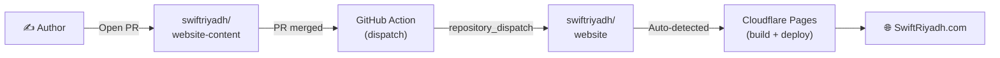

# 📝 Website Content

Content source for [SwiftRiyadh.com](https://SwiftRiyadh.com). Blogs and events in markdown, auto-deployed on merge.

---

## How It Works



1. Open a PR with your new blog or event markdown
2. PR gets reviewed and merged to `main`
3. GitHub Actions sends a `repository_dispatch` to the website repo
4. Website repo pulls the latest content and commits it
5. Cloudflare Pages auto-detects the commit and deploys

---

## Folder Structure

```
content/
├── blog/
│   └── ...
│
└── events/
    └── ...
```

---

## Content Formats

### Blog Post (`content/blog/*.md`)

```markdown
---
slug: "post-title"
title: "Post Title"
date: "2026-03-15"
author: "Your Name"
github: "yourusername"
twitter: "yourusername"
tags: ["tag1", "tag2"]
excerpt: "Short description."
cover: "https://example.com/image.jpg"
---

Content goes here...
```

**Required:** `slug`, `title`, `date`, `author`, `tags`
**Optional:** `excerpt` (auto-generated from body), `github`, `twitter`, `cover`, `readingTime` (auto-calculated)

### Event (`content/events/*.md`)

```markdown
---
slug: "event-name"
title: "Event Name"
date: "2026-04-01"
time: "18:30 - 21:00"
location: "Venue, City"
locationUrl: "https://maps.google.com/..."
speakers:
  - name: "Speaker Name"
    twitter: "username"
    github: "username"
    linkedin: "username"
tags: ["tag1", "tag2"]
rsvpLink: "https://example.com/register"
cover: "https://example.com/image.jpg"
---

Event details go here...
```

**Required:** `slug`, `title`, `date`, `time`, `location`, `speakers`, `tags`, `rsvpLink`
**Optional:** `locationUrl`, `cover`, speaker social links (`twitter`, `github`, `linkedin`)

---

## Tools

| Tool | Description |
|------|-------------|
| [Content Creator](https://swiftriyadh.com/tools/content-creator) | Create blog posts and events with frontmatter, preview, and export. Supports creating from scratch, importing existing `.md` files, or pasting raw markdown. |
| [AI Skill Generator](https://swiftriyadh.com/tools/ai-skill) | Copy a ready-made prompt for your AI assistant so it can write content in the correct format — available for both blog posts and events. |
| [Markdown Validator](https://swiftriyadh.com/tools/validator) | Paste your markdown and validate that all required frontmatter fields are present before submitting a PR. |

---

## Contributing

1. Create a new branch
2. Add your markdown file in `content/blog/` or `content/events/`
3. Use the [Content Creator](https://swiftriyadh.com/tools/content-creator) or write markdown manually following the formats above
4. Validate your content with the [Markdown Validator](https://swiftriyadh.com/tools/validator)
5. Open a PR — once merged, it goes live automatically
